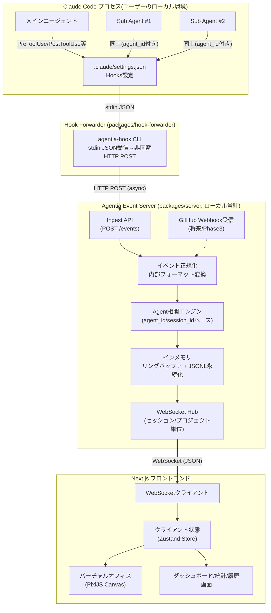
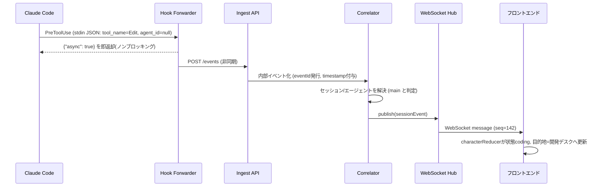

# 03. システムアーキテクチャ

## 1. 全体構成図

## 2. コンポーネント責務

| コンポーネント | 責務 | 実装候補 |
|---|---|---|
| Hook Forwarder | Claude Code Hooksからのstdin JSONを受け取り、Ingest APIへ非同期転送。Claude Code本体をブロックしない | Node.js製の小さなCLI(単一バイナリ化も検討) |
| Ingest API | HTTP POSTでイベント受信、バリデーション、内部イベント形式への変換 | Fastify |
| Correlator | `session_id`/`agent_id`/`parentAgentId`をもとに、どのAI社員に属するイベントかを解決。Sub Agent生成/消滅も判定 | Fastifyサーバー内モジュール |
| Buffer/Persistence | 直近イベントのインメモリ保持(再接続時のリプレイ用)、JSONLファイルへの追記(将来のDB移行を見据えたログ) | メモリ + ファイルシステム(MVP)、将来PostgreSQL |
| WebSocket Hub | 接続中クライアントへイベントをブロードキャスト、seq番号付与、再接続時のリプレイ処理 | ws / Socket.IO |
| フロントエンド | イベント受信→キャラクター状態/位置反映、UI描画 | Next.js + PixiJS + Zustand |

## 3. データフロー(1イベントのライフサイクル)

## 4. 技術スタック選定と採用理由

| 領域 | 候補 | 採用 | 理由 |
|---|---|---|---|
| フロントエンドFW | Next.js / CRA / Remix | **Next.js (App Router)** | ダッシュボード系の複数画面、APIルート同居、SSR不要箇所も静的化しやすい。エコシステムの厚さ |
| 言語 | TypeScript | **TypeScript (strict)** | 型安全、イベントスキーマとの整合性をコンパイル時に担保 |
| 可視化エンジン | Phaser / PixiJS / React Canvas / CSS+SVG | **PixiJS** | ゲームループ不要な軽量2D WebGL描画に特化。Phaserはシーン/物理エンジン等オーバースペック(本アプリはタイルベース移動のみで衝突演算等は不要)。CSS/SVGでは数十キャラのアニメーション+パーティクル的演出(警告アイコン等)がパフォーマンス面で不利。PixiJSは`@pixi/react`でReactツリーと統合しやすい |
| 状態管理 | Redux / Zustand / Jotai | **Zustand** | WebSocketイベント→頻繁な状態更新に対して軽量かつボイラープレートが少ない。キャラクター毎のstoreスライスが書きやすい |
| リアルタイム通信 | WebSocket(素) / Socket.IO / SSE | **WebSocket(ws) + 独自の再接続/シーケンス番号プロトコル** | SSEは単方向で将来のクライアント→サーバー操作(オフィスカスタマイズ等)に不向き。Socket.IOは便利だが独自プロトコル層が厚く、シンプルなイベントリレーには過剰。生WebSocketに薄いプロトコル(seq番号、ハートビート、再送要求)を自前実装する方が要件に対して過不足がない(`06_REALTIME_COMMUNICATION.md`) |
| バックエンド | Next.js API Routes / Fastify / Express | **Fastify(独立プロセス)** | Hookからの高頻度な小さいPOSTを低レイテンシで捌く必要があり、Next.jsのAPI Routesに同居させるとNext.jsの開発サーバー再起動等に巻き込まれやすい。WebSocketの長時間接続をNext.js API Routesで扱うのはNode実行モデル上不利なため、独立のFastifyプロセスとして常駐させ、Next.jsはピュアなフロントエンドに専念させる |
| DB(将来) | PostgreSQL / SQLite / MongoDB | **PostgreSQL + Prisma(Phase3〜)** | セッション/イベント履歴は関係性(セッション⇄プロジェクト⇄イベント⇄エージェント)が明確でリレーショナルに適する。ローカル完結性を重視するならSQLiteも代替候補だが、将来のチーム利用・クラウド化を見据えPostgreSQLを本命、開発初期はSQLiteも可(`11_DATABASE_DESIGN.md`) |
| モノレポ管理 | Turborepo / Nx / npm workspaces | **npm workspaces + Turborepo** | `apps/`(web, server) と `packages/`(hook-forwarder, shared-types, ui) の分離、ビルドキャッシュ |

## 5. なぜ「独立サーバープロセス + WebSocket」なのか

- Claude CodeのHooksは**プロセス起動のたびに短命なコマンド実行**として呼ばれる。Next.jsの開発サーバーやサーバーレス関数のようにコールドスタート・スケールインする構成では、Hookからの高頻度な着信(数百ms間隔)に対してレイテンシが安定しない。
- 常駐する軽量Fastifyサーバーであれば、イベントの受信・相関・配信を1プロセス内のメモリで完結でき、`06_REALTIME_COMMUNICATION.md`で定義するseq番号によるイベント順序保証も単一プロセス内で一貫して行える。
- フロントエンド(Next.js)とバックエンド(Fastify)を分離することで、将来的にサーバーをクラウド化(複数プロジェクト/複数マシンからの利用)する際もフロントエンドの変更を最小化できる。

## 6. デプロイ形態(MVP)

- 開発者のローカルマシンで `npm run dev` 相当の1コマンドで、Fastifyサーバー(ポート4317)とNext.js(ポート3000)を同時起動する構成(Turborepoの`dev`パイプライン)。
- Hook Forwarderは`.claude/settings.json`にコマンドパスを設定するのみで追加インストール不要(パッケージのCLIエントリをグローバル/npxで参照)。
- 外部ネットワークへの送信は行わない(ローカルloopback通信のみ)ことをMVPのデフォルトとし、将来のリモート監視(別マシンからの閲覧)はオプトインの設定で許可する。

## 7. スケーラビリティ・将来拡張の余地

- 複数プロジェクト対応: Ingest APIは`projectId`をルーティングキーとし、WebSocket Hubは`projectId`単位のチャンネルを持つ(`14_BACKEND_DESIGN.md`)。
- 複数マシン/リモートセッション対応: Ingest APIをクラウド常駐に切り替え可能なよう、認証層(将来のAPIキー方式)を`15_SECURITY_DESIGN.md`で先行設計。
- GitHub連携: 別Webhookエンドポイントを追加するのみで、内部イベントスキーマ・WebSocket Hub・フロントエンドの描画パイプラインは共通利用する。
