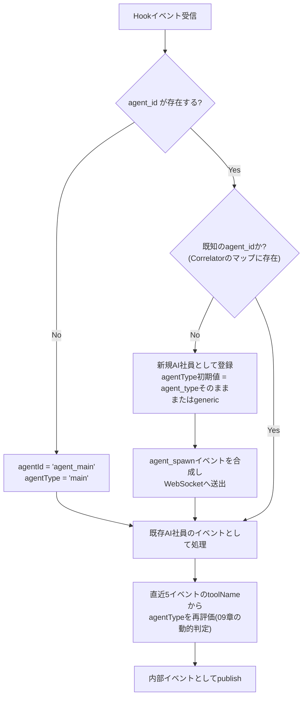

# 05. イベント設計

## 1. 内部イベント共通フォーマット

Claude Code Hooksの生ペイロードはイベント種別ごとにフィールドが異なるため、Ingest APIで以下の**内部正規化フォーマット**へ変換してからWebSocket配信・保存する。

```jsonc
{
  "eventId": "evt_01J8X...",          // サーバー側で発行するULID/UUID
  "eventSource": "claude_code",        // "claude_code" | "github"(将来)
  "projectId": "proj_agentia",         // cwdから解決するプロジェクト識別子
  "sessionId": "session_abc123",       // Hookの session_id そのまま
  "agentId": "agent_main",             // 内部ID。mainは"agent_main"固定、Sub Agentは"agent_<agent_id>"
  "agentType": "main",                 // "main" | "explore" | "plan" | "implementation" | "test" | "devops" | "github" | "generic"
  "parentAgentId": null,               // Sub Agentの場合、起動元エージェントの内部ID
  "eventType": "tool_use",             // 06.2節「イベント種別一覧」参照
  "toolName": "Edit",                  // tool_name(該当する場合のみ)
  "status": "running",                 // "running" | "success" | "error" | "waiting" | "info"
  "target": "src/services/UserService.ts", // tool_inputから抽出した対象(ファイルパス/コマンド等)
  "message": "UserService.tsを編集中",  // 日本語UI表示用の要約メッセージ(サーバー側でテンプレ生成)
  "raw": { "...": "..." },             // 元のHookペイロード(デバッグ用、フロントには送らない設定も可)
  "timestamp": "2026-07-16T10:00:00.123Z", // Ingest APIが受信した時刻(Claude Code内部の発生時刻ではない点に注意)
  "seq": 1042                          // WebSocket Hubが払い出す単調増加のセッション内シーケンス番号
}
```

> `timestamp`は`04_CLAUDE_CODE_INTEGRATION.md`で述べた通り、Hookペイロードに時刻情報がないため**受信時刻での代替**である。UIの「10:31:05 UserService.tsを読み込み」もこの受信時刻ベースで表示する。

## 2. イベント種別一覧 (`eventType`)

| eventType | 発生源Hook | 説明 |
|---|---|---|
| `session_start` | `SessionStart` | メインエージェントの出社 |
| `session_end` | `SessionEnd` | メインエージェントの退勤・セッション確定 |
| `user_prompt_submit` | `UserPromptSubmit` | ユーザーからの新規指示受信 |
| `tool_use` | `PreToolUse` | ツール実行開始(status=running) |
| `tool_result` | `PostToolUse` | ツール実行成功(status=success) |
| `tool_error` | `PostToolUseFailure` | ツール実行失敗(status=error) |
| `agent_spawn` | `SubagentStart` | Sub Agent生成 |
| `agent_stop` | `SubagentStop` | Sub Agent完了 |
| `waiting_input` | `Notification`(matcher: `permission_prompt`/`idle_prompt`/`agent_needs_input`) | ユーザー操作待ち |
| `turn_complete` | `Stop` | メインエージェントの応答完了 |
| `context_compact` | `PreCompact` / `PostCompact` | コンテキスト整理(演出用、任意) |
| `github_*` (将来) | GitHub Webhook | commit/push/pr/merge/issue/review。`eventSource: "github"` |

## 3. ツール名 → 目的地/状態のマッピングテーブル

`tool_use`/`tool_result`/`tool_error`イベントの`toolName`から、キャラクターの目的地エリアと状態を決定する中核テーブル。

| toolName | 状態(state) | 目的地エリア |
|---|---|---|
| `Read`, `Grep`, `Glob` | `reading` | 本棚・資料エリア |
| `WebSearch`, `WebFetch` | `researching` | リサーチスペース |
| `Edit`, `Write`, `MultiEdit`, `NotebookEdit` | `coding` | 開発デスク(個人デスク) |
| `Bash`(command が `npm test|jest|pytest|vitest|go test` 等にマッチ) | `testing` | QA・テストルーム |
| `Bash`(command が `docker|deploy|vercel|kubectl` 等にマッチ) | `deploying` | デプロイエリア |
| `Bash`(command が `git push|git commit|gh pr` 等にマッチ) | `terminal`→GitHub連携スペース | GitHub連携スペース(将来強化) |
| `Bash`(上記以外) | `terminal` | ターミナルルーム |
| `Task` | (自身は`planning`寄りの手配動作、新規AI社員が`agent_spawn`) | 会議室(Task発行元) |
| `ExitPlanMode` | `planning`→`moving` | 会議室・ホワイトボードエリア |
| `TodoWrite` | `planning`(短時間) | プロジェクト管理スペース |

Bashコマンド文字列の判定は正規表現ルールをサーバー側の設定ファイル(`packages/server/src/tool-classification.ts`)に外出しし、ユーザーがプロジェクトごとにカスタムコマンド(社内CIツール等)を追加登録できるようにする(マジックナンバー/ハードコード回避、設定として管理)。

## 4. Sub Agent相関ロジック



- Correlatorは`Map<agentId, AgentRuntimeState>`をセッション単位で保持する。
- `SubagentStop`受信、または最後のイベントから90秒経過で`agent_stop`を合成しMapから除去(UIには退勤演出を送出)。

## 5. イベントの重複・順序保証

- Hook Forwarderは冪等性のため、送信時に`clientEventId`(UUID v4、Claude Codeプロセス内で生成)を付与する。Ingest APIは直近10,000件の`clientEventId`をLRUキャッシュし、重複POSTを破棄する(ネットワーク再送やHookの多重発火対策)。
- WebSocket Hubは配信時に単調増加の`seq`をセッション単位で付与する。フロントエンドは`seq`のギャップを検知したら`06_REALTIME_COMMUNICATION.md`のリプレイAPIで欠落分を取得する。
- 同一`agentId`に対するイベントはIngest API内でセッション単位のキューにより**発生順を保って直列処理**する(Fastifyの単一イベントループ+セッションごとの非同期キューで実現し、並行Sub Agent間の順序は保証しないがそれぞれの内部の順序は保証する)。

## 6. メッセージテンプレート(`message`生成)

日本語の`message`はテンプレートエンジンで生成する。例:

| eventType | テンプレート |
|---|---|
| `tool_use`(Read) | `"{target}を読み込み中"` |
| `tool_use`(Grep) | `"「{query}」を検索中"` |
| `tool_result`(Edit) | `"{target}を編集しました"` |
| `tool_error` | `"{toolName}の実行中にエラーが発生しました"` |
| `agent_spawn` | `"{displayName}が調査を開始しました"` |
| `waiting_input` | `"ユーザーの入力を待っています"` |

テンプレートは`packages/server/src/message-templates.ts`に集約し、i18n化(将来の英語UI対応)を見据えてキー管理する。

## 7. スキーマバージョニング

`eventSchemaVersion: "1.0"`をイベントのトップレベルに含める(上記例では簡略化のため省略)。Claude Code側のHooks仕様変更や内部フォーマット拡張に備え、フロントエンドは非対応バージョンを受信した場合は警告を出しつつグレースフルに無視する。
