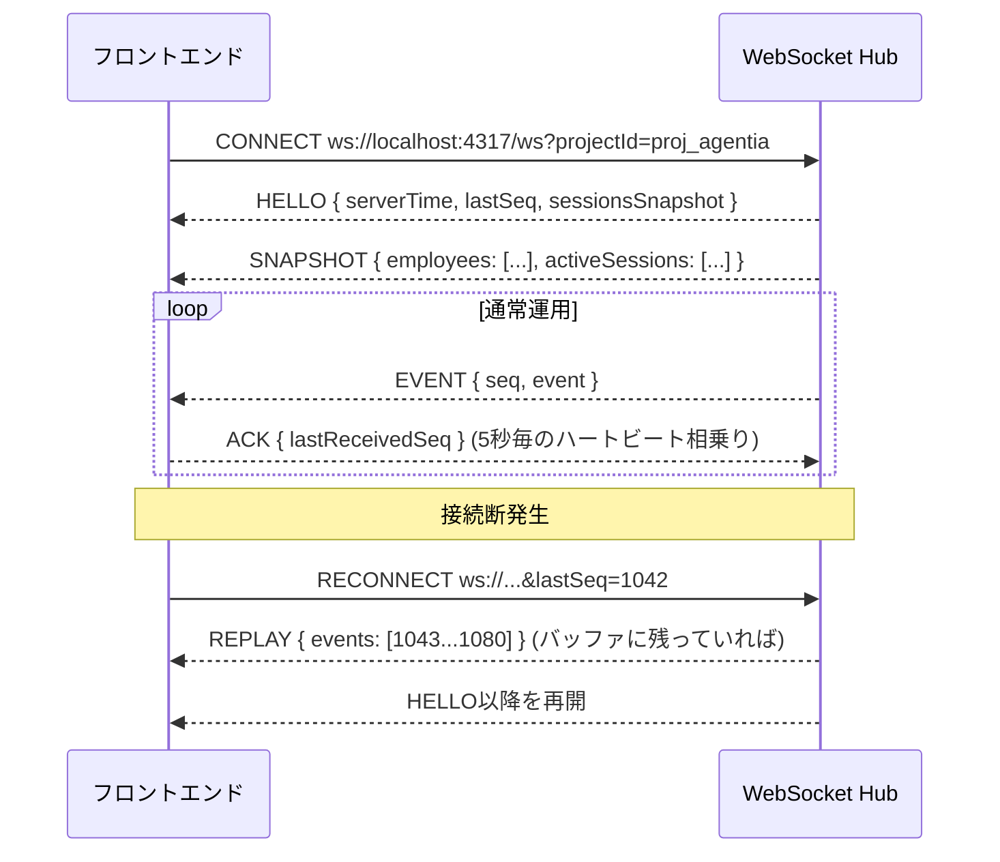

# 06. リアルタイム通信設計

## 1. 通信方式の選定

| 方式 | 評価 |
|---|---|
| SSE | 単方向のみ。将来的なクライアント→サーバー操作(オフィスレイアウト変更、フィルタ設定のサーバー保存等)に不向き。◯だが不採用 |
| Socket.IO | 再接続・ルーム機能が標準装備で魅力的だが、独自シリアライズ層が厚く、要件(JSON配信のみ)に対しては過剰。将来的にNext.js以外のクライアント(モバイル等)からの接続を考えると素WebSocketの方が相互運用しやすい |
| **WebSocket(ws) + 独自軽量プロトコル** | **採用**。以下で詳細設計する |

## 2. WebSocket接続ライフサイクル



### 2.1 メッセージ種別

| type | 方向 | 内容 |
|---|---|---|
| `HELLO` | Server→Client | 接続確立直後。`serverTime`, `lastSeq`, プロトコルバージョン |
| `SNAPSHOT` | Server→Client | 現在の全AI社員の状態・位置・アクティブセッション一覧(新規接続/再接続時の初期同期) |
| `EVENT` | Server→Client | 05章の内部イベント1件を`seq`付きでラップ |
| `HEARTBEAT` | Server→Client | 15秒毎の生存確認 |
| `ACK` | Client→Server | 受信済み`seq`の通知(サーバー側バッファのトリム判断に使用) |
| `SUBSCRIBE` | Client→Server | `projectId`切り替え時の購読変更 |
| `ERROR` | Server→Client | プロトコルエラー・非対応バージョン通知 |

### 2.2 メッセージ形式例

```jsonc
// Server → Client (EVENT)
{
  "type": "EVENT",
  "seq": 1042,
  "event": { /* 05_EVENT_DESIGN.md の内部イベント */ }
}

// Client → Server (SUBSCRIBE)
{
  "type": "SUBSCRIBE",
  "projectId": "proj_agentia"
}
```

## 3. 再接続処理

- クライアントは指数バックオフ(1s, 2s, 4s, 8s, 最大30s)で再接続を試みる。
- 再接続時、クエリパラメータ`lastSeq`に最後に処理した`seq`を付与する。
- サーバーは直近**5分間・最大2000件**のイベントをセッション単位のリングバッファに保持し、`lastSeq`以降を`REPLAY`として一括送信する。バッファ超過(長時間切断)の場合は`SNAPSHOT`で現在状態のみ復元し、欠落したアクティビティログは「一部のイベントは表示されていません」と明示する。
- UIは接続状態を`connected | reconnecting | offline`として画面右上に常時表示する。

## 4. イベント重複対策

- 05章の`clientEventId`によるIngest API側の重複排除に加え、WebSocket層でも`seq`の一意性をクライアント側で検証し、同一`seq`受信時は無視する(Hub再起動直後の境界ケース対策)。

## 5. イベント順序保証

- セッション単位で`seq`は単調増加。フロントエンドは受信`seq`が期待値と連続しない場合、短時間(300ms)バッファして並べ替えを試み、それでも揃わない場合はサーバーへ`RESYNC`要求(`lastSeq`指定の再送要求)を送る。
- 複数Sub Agentが並行する場合でも、Hub全体としては単一`seq`空間(セッション単位)を使う。フロントエンド側の`characterReducer`は`agentId`ごとに独立したキュー(10章の移動キュー)へ振り分けるため、Agent間の描画順は互いに影響しない。

## 6. ハートビート・死活監視

- サーバーは15秒毎に`HEARTBEAT`を送信。クライアントは30秒間`HEARTBEAT`もしくは`EVENT`を受信しない場合、接続を切断とみなし再接続を開始する。
- サーバー側はHookイベントの途絶(既定30秒、`04_CLAUDE_CODE_INTEGRATION.md` 5章)を検知した場合、`EVENT`として`eventType: "claude_code_offline"`を配信し、フロントエンドは全AI社員を一時オフライン表現にする。

## 7. スケール・複数クライアント対応

- 同一`projectId`を複数ブラウザタブから閲覧可能(すべて同じ`SNAPSHOT`/`EVENT`を受け取るブロードキャスト)。
- 複数プロジェクトを同時に裏で実行している場合、Hubは`projectId`ごとにチャンネル(Fastifyのws接続をMapで管理)を分離し、クライアントは`SUBSCRIBE`で切り替える。

## 8. `"type": "http"` Hookが利用可能な場合の簡略構成

Claude Codeのバージョンによっては、Hook設定の`hooks[].type`に`"http"`を指定し、Claude Code自身がHookペイロードを直接指定URLへPOSTできる(`04_CLAUDE_CODE_INTEGRATION.md` 1章)。この場合、`Hook Forwarder`プロセスを省略し、`.claude/settings.json`から直接`http://localhost:4317/events`へPOSTする構成に切り替えられる。Ingest API側のインターフェースは変わらないため、セットアップ画面(`08_SCREEN_DESIGN.md` クラウドコード接続設定)で両方式を自動検出し、利用可能な方を案内する。

## 9. セキュリティ(概要、詳細は`15_SECURITY_DESIGN.md`)

- WebSocketはデフォルトで`localhost`バインドのみ。外部公開する場合は接続時トークン(`?token=`)を必須化する設定を用意する。
