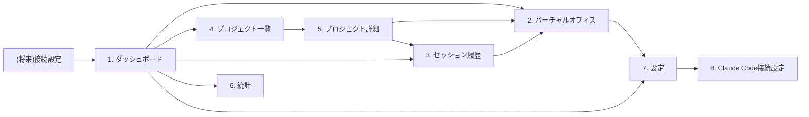

# 08. 画面設計

## 0. 画面一覧・遷移図



共通ナビゲーション(左サイドバー): ダッシュボード / バーチャルオフィス / プロジェクト一覧 / セッション履歴 / 統計 / 設定。プロジェクト切替セレクタをサイドバー上部に常設(14章)。

---

## 1. ダッシュボード

**目的**: アプリを開いて最初に見る画面。現在の稼働状況を俯瞰する。

**表示項目**: 現在のプロジェクト・セッション状態サマリ、直近のアクティビティログ(簡易版)、AI社員数・ステータス内訳、当日/週間の利用統計サマリ、クイックリンク(オフィスを開く)。

**操作**: 「オフィスを見る」ボタンでバーチャルオフィスへ。プロジェクト切替。

```
┌──────────────────────────────────────────────────────────────────────┐
│ Agentia   [Project: agentia ▾]                        ● connected     │
├───────────┬──────────────────────────────────────────────────────────┤
│ ▣ Dashboard│  今日のサマリ                                            │
│ ▢ Office   │  ┌───────────┬───────────┬───────────┬───────────┐      │
│ ▢ Projects │  │ 稼働時間   │ 編集ファイル│ Bash実行  │ テスト成功 │      │
│ ▢ History  │  │ 2h 14m    │ 12         │ 34        │ 8 / 9      │      │
│ ▢ Stats    │  └───────────┴───────────┴───────────┴───────────┘      │
│ ▢ Settings │                                                          │
│            │  AI社員 (3名 稼働中)          [ オフィスを見る → ]       │
│            │  ┌────────────────────────────────────────────────┐    │
│            │  │ 👤 Claude(Main)       coding: UserService.ts     │    │
│            │  │ 👤 Explore Agent #1   reading: authService.ts    │    │
│            │  │ 👤 Test Agent #1      testing: npm test          │    │
│            │  └────────────────────────────────────────────────┘    │
│            │                                                          │
│            │  最近のアクティビティ                                    │
│            │  10:31:25 npm testを実行                                │
│            │  10:31:18 UserService.tsを編集                          │
│            │  10:31:10 authService.tsを検索                          │
└───────────┴──────────────────────────────────────────────────────────┘
```

---

## 2. バーチャルオフィス(メイン画面)

**目的**: 本アプリの中核。オフィス全景とキャラクターのリアルタイム動作を表示する。

**表示項目**: オフィスマップ(10章)、キャラクター、現在の作業カード、アクティビティログ、プロジェクト情報、Claude Code状態。各パネルは折りたたみ可能。

**操作**: キャラクタークリックで詳細吹き出し、ログクリックでフォーカス、パネル開閉。

```
┌──────────────────────────────────────────────────────────────────────┐
│ Agentia   [Project: agentia ▾]     Session 00:42:10        ● connected│
├───────────┬───────────────────────────────────────┬──────────────────┤
│ ▢ Dashboard│                                       │ 現在の作業        │
│ ▣ Office   │   本棚📚      リサーチ🔍     会議室🗂  │ ┌────────────┐   │
│ ▢ Projects │                                       │ │Claude(Main)│   │
│ ▢ History  │   ┌──┐                        ┌──┐   │ │coding      │   │
│ ▢ Stats    │   │👤│reading                  │  │   │ │UserService │   │
│ ▢ Settings │   └──┘                        └──┘   │ │.tsを編集中 │   │
│            │  ─────────── 廊下 ───────────────    │ └────────────┘   │
│            │                                       │ ┌────────────┐   │
│            │   開発デスク💻            管理📋      │ │Explore #1  │   │
│            │     ┌──┐  ┌──┐                       │ │researching │   │
│            │     │👤│  │  │                        │ │認証処理を  │   │
│            │     └──┘  └──┘ coding                 │ │調査中      │   │
│            │  ─────────── 廊下 ───────────────    │ └────────────┘   │
│            │                                       ├──────────────────┤
│            │   端末🖥  QA🧪  デプロイ🚀  Server🗄  │ アクティビティログ│
│            │              ┌──┐⚠                    │ 10:31:25 test実行│
│            │              │👤│testing→error         │ 10:31:18 編集    │
│            │  ─────────── 廊下 ───────────────    │ 10:31:10 検索    │
│            │   休憩☕        GitHub🐙               │ 10:31:05 読込    │
└───────────┴───────────────────────────────────────┴──────────────────┘
```

---

## 3. セッション履歴

**目的**: 過去のClaude Codeセッション一覧を振り返る。

**表示項目**: セッション一覧(日時・プロジェクト・時間・イベント数・成功/失敗数)、検索・フィルタ、詳細への遷移。

**操作**: 行クリックでセッション詳細(そのセッションのログ再生/統計)へ。

```
┌──────────────────────────────────────────────────────────────────────┐
│ Agentia                              [Project: agentia ▾]             │
├───────────┬──────────────────────────────────────────────────────────┤
│ ▢ Dashboard│  セッション履歴          検索:[__________] フィルタ:[全て▾]│
│ ▢ Office   │ ┌────────────┬──────┬────────┬──────┬────────┬────────┐ │
│ ▢ Projects │ │ 日時        │project│ 時間   │イベント│編集数  │成功/失敗│ │
│ ▣ History  │ ├────────────┼──────┼────────┼──────┼────────┼────────┤ │
│ ▢ Stats    │ │ 07/16 10:00 │agentia│ 42m   │ 312  │ 8      │ 8/9    │ │
│ ▢ Settings │ │ 07/15 21:30 │agentia│ 1h20m │ 540  │ 15     │ 12/12  │ │
│            │ │ 07/15 09:10 │other  │ 25m   │ 120  │ 3      │ 4/4    │ │
│            │ └────────────┴──────┴────────┴──────┴────────┴────────┘ │
│            │  行をクリックで詳細(ログ再生)へ                          │
└───────────┴──────────────────────────────────────────────────────────┘
```

---

## 4. プロジェクト一覧

**目的**: 複数のClaude Codeプロジェクトを切り替え・管理する。

**表示項目**: プロジェクトカード一覧(名称、最終利用日、累計利用時間、直近ステータス)。

**操作**: カードクリックでプロジェクト詳細へ。「+ プロジェクトを追加」で新規登録(cwdの登録)。

```
┌──────────────────────────────────────────────────────────────────────┐
│ Agentia                                                                │
├───────────┬──────────────────────────────────────────────────────────┤
│ ▢ Dashboard│  プロジェクト一覧                     [+ プロジェクトを追加]│
│ ▢ Office   │ ┌───────────────────┐ ┌───────────────────┐             │
│ ▣ Projects │ │ 📁 agentia         │ │ 📁 my-api-service  │             │
│ ▢ History  │ │ 最終利用: 2分前     │ │ 最終利用: 3日前     │             │
│ ▢ Stats    │ │ 累計 18h 40m       │ │ 累計 4h 05m        │             │
│ ▢ Settings │ │ ● 稼働中           │ │ ○ アイドル         │             │
│            │ └───────────────────┘ └───────────────────┘             │
│            │ ┌───────────────────┐                                    │
│            │ │ 📁 landing-page    │                                    │
│            │ │ 最終利用: 1週間前   │                                    │
│            │ │ 累計 1h 12m        │                                    │
│            │ │ ○ アイドル         │                                    │
│            │ └───────────────────┘                                    │
└───────────┴──────────────────────────────────────────────────────────┘
```

---

## 5. プロジェクト詳細

**目的**: 特定プロジェクトの統計・セッション・設定を集約する。

**表示項目**: プロジェクト基本情報(パス、ブランチ、接続設定状態)、累計統計、セッション履歴(絞り込み済み)、そのプロジェクトのオフィスを開くボタン。

```
┌──────────────────────────────────────────────────────────────────────┐
│ Agentia   ← プロジェクト一覧へ                                         │
├───────────┬──────────────────────────────────────────────────────────┤
│ ▢ Dashboard│  📁 agentia                            [ オフィスを開く → ]│
│ ▢ Office   │  path: /home/user/Agentia   branch: main                │
│ ▣ Projects │  Hooks接続: ● 設定済み                                    │
│ ▢ History  │                                                          │
│ ▢ Stats    │  累計統計                                                │
│ ▢ Settings │  ┌───────────┬───────────┬───────────┬───────────┐      │
│            │  │ 総利用時間 │ セッション数│ 編集ファイル│Sub Agent数│      │
│            │  │ 18h 40m   │ 24         │ 210        │ 58        │      │
│            │  └───────────┴───────────┴───────────┴───────────┘      │
│            │                                                          │
│            │  このプロジェクトのセッション履歴 (3章と同一UIの絞込表示)  │
└───────────┴──────────────────────────────────────────────────────────┘
```

---

## 6. 統計

**目的**: プロジェクト横断/期間別の利用傾向を可視化する。

**表示項目**: 期間選択(日/週/月)、利用時間推移グラフ、ツール利用内訳(円グラフ)、テスト成功率推移、Sub Agent利用数推移。

```
┌──────────────────────────────────────────────────────────────────────┐
│ Agentia                                    期間: [週 ▾] [全プロジェクト▾]│
├───────────┬──────────────────────────────────────────────────────────┤
│ ▢ Dashboard│  利用時間推移                                            │
│ ▢ Office   │  ▂▃▅▇▆▄▂  (月火水木金土日)                              │
│ ▢ Projects │                                                          │
│ ▢ History  │  ツール利用内訳          テスト成功率        Sub Agent数 │
│ ▣ Stats    │   Edit 35%              ▇▇▇▇▇▆▆ 92%        1.2 → 3.4   │
│ ▢ Settings │   Read 28%                                               │
│            │   Bash 20%                                               │
│            │   Web  10%                                               │
│            │   他    7%                                               │
└───────────┴──────────────────────────────────────────────────────────┘
```

---

## 7. 設定

**目的**: 表示・通知・プライバシーに関する全般設定。

**表示項目**: 表示設定(名札常時表示/ホバー表示、アニメーション速度)、通知設定(将来: 効果音)、プライバシー設定(ユーザープロンプト内容の表示有無)、データ管理(ログ保持期間、エクスポート)。

```
┌──────────────────────────────────────────────────────────────────────┐
│ Agentia                                                                │
├───────────┬──────────────────────────────────────────────────────────┤
│ ▢ Dashboard│  設定                                                    │
│ ▢ Office   │  表示                                                    │
│ ▢ Projects │   名札表示: (●) 常時  ( ) ホバー時のみ                    │
│ ▢ History  │   アニメーション速度: [—●———] 標準                       │
│ ▢ Stats    │                                                          │
│ ▣ Settings │  プライバシー                                            │
│            │   ユーザープロンプト内容の表示: [ ] 有効にする(既定OFF)  │
│            │                                                          │
│            │  データ管理                                              │
│            │   ログ保持期間: [30日 ▾]     [ エクスポート ] [ 全削除 ]  │
│            │                                                          │
│            │   Claude Code接続設定 → [8. 接続設定を開く]              │
└───────────┴──────────────────────────────────────────────────────────┘
```

---

## 8. Claude Code接続設定

**目的**: Hooksのセットアップ状況を確認・設定する(初回オンボーディング兼設定確認)。

**表示項目**: 検出されたプロジェクトの`.claude/settings.json`のHooks設定状態(未設定/設定済み/一部不足)、ワンクリックセットアップボタン(設定ファイルへの追記)、接続テスト(ダミーイベント送信→受信確認)、Ingest Serverの起動状態・ポート。

```
┌──────────────────────────────────────────────────────────────────────┐
│ Agentia                                                                │
├───────────┬──────────────────────────────────────────────────────────┤
│ ▢ Dashboard│  Claude Code接続設定                                     │
│ ▢ Office   │                                                          │
│ ▢ Projects │  Ingest Server: ● 起動中 (localhost:4317)                │
│ ▢ History  │                                                          │
│ ▢ Stats    │  プロジェクト: agentia                                   │
│ ▣ Settings │   .claude/settings.json: ⚠ Hooks未設定                   │
│            │   [ ワンクリックで設定を追加 ]                            │
│            │                                                          │
│            │   設定後の確認:                                          │
│            │   [ 接続テストを実行 ]  → 「テストイベントを受信しました」 │
│            │                                                          │
│            │   手動設定用のJSONを表示 [ 表示する ]                     │
└───────────┴──────────────────────────────────────────────────────────┘
```

## 9. コンポーネント構成(共通)

- `AppShell`(サイドバー+ヘッダ+コンテンツスロット)
- `ProjectSwitcher`(サイドバー上部、全画面共通)
- `ConnectionStatusBadge`(ヘッダ右上、全画面共通)
- `OfficeCanvas`(2画面のみ: ダッシュボードのミニプレビュー、バーチャルオフィスのフル表示)
- `EmployeeCard` / `ActivityLogList` / `StatTile` / `SessionTable` / `ProjectCard`

詳細なコンポーネント階層・Props設計は`13_FRONTEND_DESIGN.md`を参照。
