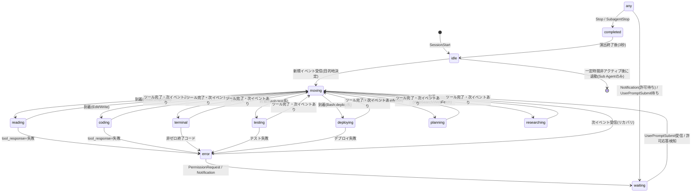

# 09. キャラクターシステム設計

## 1. 概要

Claude Codeの「メインエージェント」および「Sub Agent(Task tool)」を、オフィス内を動き回る**AI社員キャラクター**として表現する。役職は固定リストではなく、実行時に検出したエージェント種別から**動的生成**する。

## 2. AI社員モデル

### 2.1 データ構造

```typescript
interface Employee {
  agentId: string;              // 内部生成ID (例: "agent_main", "agent_sub_3f2a")
  sessionId: string;            // 紐づくClaude Codeセッション
  parentAgentId: string | null; // Sub Agentの場合、起動元(通常はメイン)
  role: EmployeeRole;           // 動的に決定される役職
  displayName: string;          // UI表示名 (例: "Explore Agent #2")
  avatarVariant: number;        // 見た目バリエーション(色/アクセサリ差分。0-7を循環割当)
  state: CharacterState;        // 09.3節参照
  position: { x: number; y: number; areaId: string };
  destination: { x: number; y: number; areaId: string } | null;
  currentTask: string | null;   // 「UserService.tsを編集中」等、人間可読な現在作業
  currentTool: string | null;   // 直近のtoolName
  spawnedAt: string;            // ISO timestamp
  completedAt: string | null;
  hasWarning: boolean;          // エラー/警告アイコン表示フラグ
  movementQueue: MovementStep[];// 10章参照
}
```

### 2.2 役職 (EmployeeRole) 決定ロジック

固定の役職テーブルを「ヒント」として持ちつつ、Sub Agentの`agent_type`(Hookペイロードのフィールド。取得可否は`04_CLAUDE_CODE_INTEGRATION.md`参照)や、観測されたツール利用パターンから動的にマッピングする。

| role (内部キー) | 表示名 | 判定条件 | 主な行動 |
|---|---|---|---|
| `main` | プロジェクトマネージャー 兼 メインエンジニア | メインセッションのエージェント(`agent_id`/`agent_type`が省略/null) | 全ツール、Task起動 |
| `explore` | リサーチエンジニア | agent_type ∈ {Explore, general-purpose(調査系プロンプト)} または直近ツールがRead/Grep/Glob中心 | Read, Grep, Glob |
| `plan` | システムアーキテクト | agent_type = Plan、またはPlanモード中 | 設計・計画 |
| `implementation` | ソフトウェアエンジニア | Edit/Write比率が高い | Edit, Write, MultiEdit |
| `test` | QAエンジニア | Bashコマンドが test/lint/build系 | Bash(test), 結果判定 |
| `devops` | インフラ/デプロイエンジニア | Bashコマンドがdeploy/docker/git push系 | Bash(deploy) |
| `github` | リポジトリ担当 | git/gh関連コマンド、将来のGitHub Webhook起因 | commit, push, PR |
| `generic` | AI社員(役職不明) | 上記に当てはまらない場合のフォールバック | 汎用 |

> 判定はイベント列を見て**動的に再評価**される(例: explore役として生成されたSub AgentがEditを開始したら implementation に遷移し、デスク移動が発生する)。固定の役職に縛られない設計とすることで、将来Anthropicがsubagent_typeの語彙を拡張しても壊れない。

### 2.3 生成・消滅ライフサイクル

- **生成トリガー**: `SessionStart`(main)、`PreToolUse`(tool_name = "Task")検知時にSub Agentを仮生成(`spawning`扱い、会議室ドアから登場するアニメーション)
- **消滅トリガー**: `SubagentStop`受信、または一定時間(既定90秒)非アクティブで「退勤」扱いにしてフェードアウト。UI上は完全削除せず、アクティビティログ・統計には残す。
- 同時に存在するSub Agentは配列で管理し、それぞれ独立した`position`/`state`/`movementQueue`を持つ。

## 3. キャラクター状態 (CharacterState)

```
idle | moving | researching | reading | planning | coding | terminal | testing | deploying | waiting | error | completed
```

| 状態 | 意味 | 表示 |
|---|---|---|
| `idle` | 自席で待機、次の指示待ち | 椅子に座りPCを見ている |
| `moving` | エリア間移動中 | 歩行アニメーション |
| `researching` | Web検索・外部調査中 | リサーチスペースでノートPC |
| `reading` | Read/Grep/Glob実行中 | 本棚/資料エリアで本や紙を見る |
| `planning` | Plan中・設計中 | 会議室でホワイトボードに書き込む |
| `coding` | Edit/Write実行中 | 開発デスクでタイピング |
| `terminal` | Bash実行中 | ターミナルルームでキーボード入力 |
| `testing` | テスト/Lint/Build実行中 | QAルームでチェックリスト |
| `deploying` | デプロイ系コマンド実行中 | デプロイエリアでレバー操作演出 |
| `waiting` | ユーザー入力待ち(Notification/permission) | 頭上に「?」、時計を見る仕草 |
| `error` | 直前ツールが失敗 | 頭上に警告アイコン(⚠)、一時停止ポーズ |
| `completed` | セッション/タスク完了 | 休憩スペースでガッツポーズ→自席へ |

### 3.1 状態遷移図



`any`は`idle, moving, reading, coding, terminal, testing, deploying, planning, researching`のいずれからも遷移可能であることを表す簡略表記。

### 3.2 優先度ルール

同時に複数の状態遷移候補がある場合の優先順位(高→低):

1. `error` (直近ツール失敗)
2. `waiting` (ユーザー入力/許可待ち — Claude Codeが完全に停止しているため最優先で伝える)
3. 実行中ツールに対応する作業状態 (`coding`/`terminal`/... )
4. `moving`
5. `idle`

## 4. キャラクター描画レイヤー

- **Body**: 役職ごとの配色バリエーション(スーツ/カジュアル等のIT企業感のあるフラットデザイン、子供向けにしない)
- **状態アイコン**: 頭上に小さいアイコン(📖 reading, ⌨️ coding, ⚠ error, 💬 waiting 等)— MVPではCSS/SVGアイコン、キャラ本体はスプライトまたはCSS図形
- **名札**: displayNameとroleを表示するフローティングラベル(ホバー/常時、設定で切替)
- **吹き出し**: `currentTask`を短く要約して一時的に表示(例:「UserService.tsを編集中」)

## 5. 実装レイヤーとの対応

キャラクターの状態・位置はフロントエンドのクライアント状態(Zustand等、`13_FRONTEND_DESIGN.md`参照)で管理し、WebSocketで受信した内部イベント(`05_EVENT_DESIGN.md`)を`characterReducer`が解釈して`state`/`destination`/`currentTask`を更新する。実際の描画エンジン選定は`03_SYSTEM_ARCHITECTURE.md`・`10_OFFICE_SYSTEM.md`を参照。
