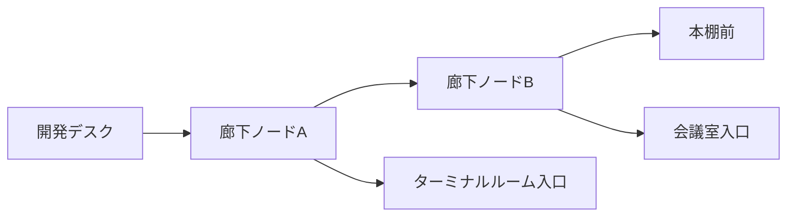

# 10. オフィスシステム設計

## 1. オフィスマップ概要

見下ろし型2.5D(タイルベース、疑似奥行きはZ-order/spriteのY座標ソートで表現)のワンフロアオフィス。グリッド単位は1タイル=32px想定。

```
 ┌────────────────────────────────────────────────────────────────────┐
 │  本棚・資料エリア        調査・リサーチスペース        会議室        │
 │  (Library)               (Research Space)              (Meeting)    │
 │                                                                      │
 │  ─────────────────────────── 廊下(Corridor) ───────────────────────│
 │                                                                      │
 │  メイン開発エリア(個人デスク群)              プロジェクト管理     │
 │  (Dev Floor / Desks)                           スペース             │
 │                                                                      │
 │  ─────────────────────────── 廊下(Corridor) ───────────────────────│
 │                                                                      │
 │  ターミナルルーム   QAテストルーム   デプロイエリア   サーバールーム │
 │  (Terminal)         (QA Room)        (Deploy)         (Server Room) │
 │                                                                      │
 │  ─────────────────────────── 廊下(Corridor) ───────────────────────│
 │                                                                      │
 │  休憩スペース(Break Room)          GitHub連携スペース(GitHub Hub)  │
 └────────────────────────────────────────────────────────────────────┘
```

## 2. エリア定義一覧

| areaId | 名称 | 紐づくイベント/状態 | AI社員の振る舞い | UI表示 |
|---|---|---|---|---|
| `dev_floor` | メイン開発エリア(個人デスク) | `coding` | デスクでタイピング | 開いているファイル名を頭上に表示 |
| `personal_desk` | 個人デスク(idle/completed待機) | `idle`, `completed`直後 | 椅子でくつろぐ/伸びをする | 状態アイコンなし(平常) |
| `meeting_room` | 会議室・ホワイトボードエリア | `planning`(Plan/ExitPlanMode)、Sub Agent生成(Task) | ホワイトボードに図を描く。新規AI社員はここから登場 | Todoリスト/計画項目を模した付箋UI |
| `research_space` | 調査・リサーチスペース | `researching`(WebSearch/WebFetch) | ノートPCでブラウジング仕草 | 検索クエリの吹き出し |
| `library` | 本棚・資料エリア | `reading`(Read/Grep/Glob) | 本棚から資料を取り出す/床に広げた紙を読む | 読んでいるファイルパス表示 |
| `terminal_room` | ターミナルルーム | `terminal`(Bashの一般コマンド) | キーボード早打ちアニメーション | 実行中コマンドをテロップ表示 |
| `qa_room` | QA・テストルーム | `testing`(test/lint/build系Bash) | チェックリストにチェックを入れる仕草 | テスト結果(成功/失敗数)をミニパネル表示 |
| `deploy_area` | デプロイエリア | `deploying`(deploy系Bash) | レバーを引く/ロケット発射演出 | デプロイ先・進捗バー(疑似) |
| `server_room` | サーバールーム | (将来: インフラ関連イベント、現状は装飾+将来拡張枠) | サーバーラックの点検動作 | 稼働ランプの点滅(将来的にDB/インフラ監視と連携) |
| `break_room` | 休憩スペース | `completed`(Stop/SubagentStop直後)、`idle`長時間時 | コーヒーを飲む、ソファでくつろぐ | 完了したタスクのサマリーカード |
| `github_hub` | GitHub連携スペース | (将来)commit/push/PR/merge/review | PC前でGitHubのロゴが浮かぶ演出 | 直近のcommit/PR一覧(将来) |
| `pm_space` | プロジェクト管理スペース | `TodoWrite`、タスク分割 | カンバンボードを操作する仕草 | Todoリストの進捗バー |

## 3. 座標管理

```typescript
interface OfficeArea {
  areaId: string;
  name: string;
  bounds: { x: number; y: number; width: number; height: number }; // タイル座標系
  entryPoint: { x: number; y: number };  // このエリアに入る際の目標座標
  deskSlots?: { x: number; y: number }[]; // 個人デスクエリア等、複数AI社員が同時利用する場合のスロット
  capacity: number; // 同時収容可能なAI社員数(超過時は次の空きスロット待ち、または近接スロットへ)
}
```

- 全エリア・通路はマップ定義JSON(`packages/web/src/office/map.json`)としてフロントエンドに静的配置。MVPでは1フロア固定、Phase4のオフィス拡張時は複数マップファイル+アンロック状態をDBで管理。
- `deskSlots`はエリア内の複数キャラクター同時表示時の重なり防止に使う。空きスロットがない場合は、待機列(エリア手前で立ち止まる)として表現し、順番に入室する自然な演出にする。

## 4. 移動(パスファインディング)設計

### 4.1 経路の考え方

タイルの障害物マップに対し**事前定義された通路ウェイポイント**をベースにしたウェイポイントグラフ移動を採用する(汎用A*ではなく、オフィスレイアウトが固定であることを活かしたシンプルな方式)。



- 各エリアの`entryPoint`同士は`map.json`内の`waypoints`グラフで接続され、移動時はダイクストラ法(ノード数が数十程度のため軽量)で最短経路を求め、経由点列を生成する。
- キャラクターは経由点間を一定速度(タイル/秒)で直線移動し、到着ごとに次の経由点へ向く(向き=スプライトのflip/方向アニメーション切り替え)。

### 4.2 移動中の新規イベント処理方針

理想は「自然に見える」ことなので、以下のポリシーを採用する。

| ケース | 処理 |
|---|---|
| 同一エリアへの新規イベント(同じ目的地) | 現在の移動を継続。到着後の状態のみ更新 |
| 異なるエリアへの新規イベント、かつ優先度が同等以下 | **キューに追加**。現在の移動・作業を最後まで行った後に次へ向かう(頻繁なイベントでキャラクターが震えるように往復するのを防止) |
| 異なるエリアへの新規イベント、かつ優先度が高い(`error`, `waiting`) | **現在の移動を中断**し、即座に新しい目的地へ経路を再計算して向かう |
| キューが一定長(既定3件)を超過 | 古いキュー項目を間引き、直近の状態のみを反映(「要約」動作、頭上に「+2」等のバッジで省略があったことを示す) |

```typescript
interface MovementStep {
  destinationAreaId: string;
  reason: EventInternal;   // このステップを発生させたイベント
  priority: number;        // error/waiting=100, 通常ツール=50, idle復帰=10
}
```

処理ロジック(`characterReducer`内`movement-queue.ts`):

```
on new event E:
  step = toMovementStep(E)
  if character.movementQueue is empty and character.state == idle/moving同エリア:
      startMoving(step)
  else if step.priority > currentStep.priority:
      interruptAndReplace(step)   // 現在の移動を中断し即時切替
  else:
      enqueue(step, maxQueueLength=3, dropOldestOnOverflow=true)
```

### 4.3 到着後の状態確定

到着(`arrived`イベント、フロントエンド内部でのみ発火)をトリガーに、`09_CHARACTER_SYSTEM.md`の状態遷移表に従い`state`を確定する。到着前に対応する`tool_result`/`tool_error`が先に届いていた場合は、到着と同時に即座に次の状態へ遷移する(作業アニメーションを飛ばさない程度に短縮表示)。

## 5. カメラ・表示

- MVPでは固定俯瞰カメラ(スクロール不要な1画面に全エリアを収める設計)。
- Phase2以降、AI社員数増加でエリアが密集する場合はパン・ズーム操作を追加(PixiJSの`viewport`プラグイン相当)。

## 6. 将来のオフィス拡張(Phase4向けフック)

- `OfficeArea`定義に`unlockLevel: number`を追加し、会社レベルに応じて非表示→表示に切り替えるだけで拡張できるようにする(座標体系・移動グラフの再設計が不要な形で拡張ポイントを確保)。
