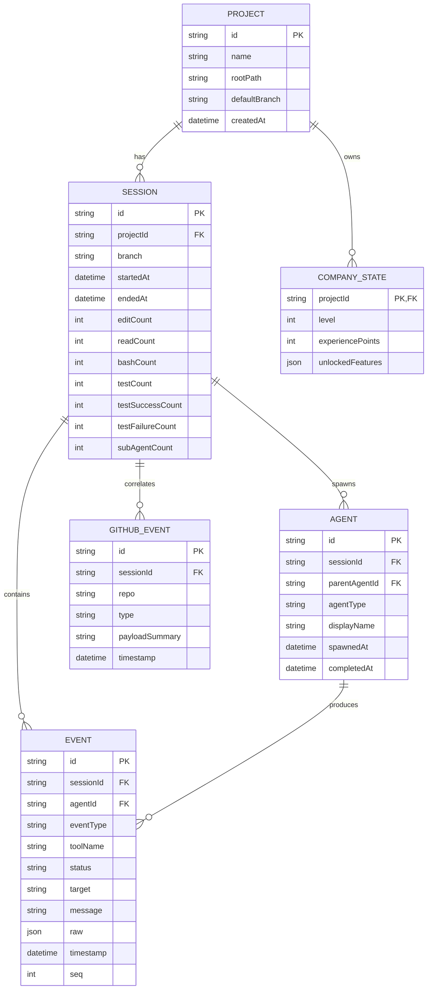

# 11. データベース設計

## 1. MVPの方針: DBレス

MVPでは永続化を持たない。理由:

- 可視化のリアルタイム性能検証を優先し、スキーマ設計・マイグレーションの手戻りコストを避ける。
- セッション中のイベントはIngest Serverのインメモリリングバッファ+JSONLファイル(`~/.agentia/logs/<sessionId>.jsonl`)への追記のみで、`06_REALTIME_COMMUNICATION.md`の再接続リプレイに使う。
- ダッシュボードの「セッション履歴」「統計」画面はPhase3でDB導入するまでは、このJSONLファイル群をアプリ起動時にスキャンして簡易集計する(件数が少ない前提のMVP用簡易実装)。

## 2. 将来のDB選定

| 候補 | 評価 |
|---|---|
| SQLite | ローカル完結・ゼロ設定という点でMVP後の第一段階として魅力的。将来のマルチマシン共有には不向き |
| **PostgreSQL(採用、Phase3〜)** | リレーショナルな整合性、将来のクラウド化・チーム利用を見据えた拡張性、Prismaとの親和性 |
| MongoDB | イベントログのスキーマレス性とは相性が良いが、集計・統計クエリ(SQL)の書きやすさでPostgreSQLを優先 |

ローカル専用に倒すなら「Phase3はSQLite、チーム利用に発展する場合にPostgreSQLへ移行」という段階案も許容するが、本設計ではAPI層(Prisma経由)を切り替え可能にしておくことで両対応する。

## 3. ER図(Phase3導入時点)

## 4. テーブル定義補足

| テーブル | 用途 | 備考 |
|---|---|---|
| `Project` | プロジェクト単位の識別・累計情報の親 | `rootPath`はcwdの正規化パスで一意 |
| `Session` | 1回のClaude Code起動〜終了の単位。統計カウンタを非正規化して保持(集計クエリ高速化) | `endedAt`がnullなら進行中セッション |
| `Agent` | メイン/Sub Agentの実体。`parentAgentId`で階層を表現 | `agentType`は動的判定結果を保存(履歴として固定化) |
| `Event` | 内部イベントの永続化(05章のフォーマットとほぼ1:1) | `raw`はJSONB、デバッグ・将来の再分析用 |
| `CompanyState` | Phase4ゲーム要素用。プロジェクト単位で会社レベル・経験値を保持 | MVP/Phase3では未使用、テーブルのみ先行作成可 |
| `GithubEvent` | 将来のGitHub連携イベント保存 | `sessionId`はcommit時刻等から近似相関(nullable) |

## 5. インデックス方針

- `Event(sessionId, seq)` 複合インデックス(セッション内の時系列取得)
- `Event(agentId, timestamp)`(AI社員別ログ取得)
- `Session(projectId, startedAt desc)`(履歴一覧のページング)

## 6. データ保持・削除方針

- 設定画面(`08_SCREEN_DESIGN.md` 7章)からログ保持期間を設定可能(既定30日)。バッチジョブ(cron的な軽量スケジューラ)で期限切れの`Event`/セッションJSONLを削除する。
- `raw`列(生Hookペイロード)はユーザープロンプト内容等を含みうるため、保持期間を他カラムより短く設定できるオプションを用意する(プライバシー配慮、`15_SECURITY_DESIGN.md`参照)。

## 7. Prisma移行時の方針

- `packages/db`に`schema.prisma`を配置し、Ingest Server(Fastify)からのみアクセスする(フロントエンドから直接DBアクセスしない)。
- MVP→Phase3移行時、JSONLファイルからのバックフィルスクリプト(`scripts/import-jsonl.ts`)を用意し、既存ローカルログを失わずに移行できるようにする。
