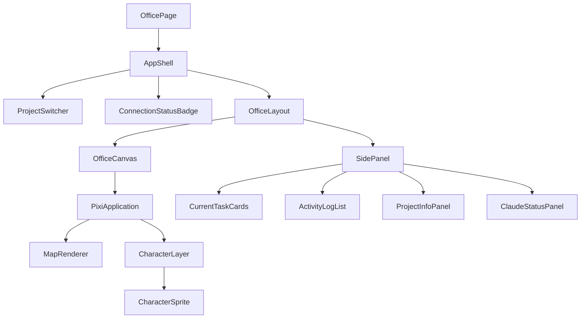

# 13. フロントエンド設計

## 1. ディレクトリ構成(フロントエンド部分)

```
apps/web/
├── app/                        # Next.js App Router
│   ├── (dashboard)/dashboard/page.tsx
│   ├── office/page.tsx
│   ├── history/page.tsx
│   ├── history/[sessionId]/page.tsx
│   ├── projects/page.tsx
│   ├── projects/[projectId]/page.tsx
│   ├── stats/page.tsx
│   ├── settings/page.tsx
│   ├── settings/connection/page.tsx
│   └── layout.tsx
├── src/
│   ├── components/             # 画面横断の汎用UIコンポーネント(StatTile, ActivityLogList等)
│   ├── features/
│   │   ├── office/             # バーチャルオフィス機能一式
│   │   │   ├── canvas/         # PixiJS描画レイヤー
│   │   │   ├── characters/     # キャラクター描画・アニメーション
│   │   │   ├── movement/       # 移動キュー・パスファインディング(10章ロジック)
│   │   │   └── map/            # map.json、エリア定義
│   │   ├── dashboard/
│   │   ├── history/
│   │   ├── projects/
│   │   └── stats/
│   ├── hooks/                  # useWebSocket, useEmployeeState 等
│   ├── stores/                 # Zustandストア(05_EVENT_DESIGN準拠の型)
│   ├── services/               # REST APIクライアント(fetchラッパー)
│   └── lib/                    # 汎用ユーティリティ
└── public/
```

## 2. 状態管理設計(Zustand)

```typescript
interface OfficeStore {
  employees: Record<string, Employee>;         // agentIdキー
  activityLog: ActivityLogEntry[];              // 直近N件(既定500件、古いものは切り捨て)
  connectionState: "connected" | "reconnecting" | "offline";
  currentProject: ProjectSummary | null;
  sessionStats: SessionStats;

  // actions
  applyEvent: (event: EventInternal) => void;   // WebSocket受信イベントの反映(reducer相当)
  setConnectionState: (s: ConnectionState) => void;
  hydrateSnapshot: (snapshot: SnapshotPayload) => void;
}
```

- `applyEvent`は05章の内部イベントを受け取り、対象`Employee`の`state`/`destination`/`currentTask`/`hasWarning`を更新し、`activityLog`に追記する純粋関数群(`office/movement/apply-event.ts`)として実装し、単体テストしやすくする。
- キャラクターの実座標(アニメーション中の連続値)はZustandではなくPixiJS側のTicker管理下のローカル状態に持たせ、Zustandは「目的地・状態」という離散的な真実の情報源(source of truth)のみを保持する(頻繁な座標更新でReact再レンダリングを起こさないため)。

## 3. コンポーネント階層(バーチャルオフィス画面)



- `OfficeCanvas`は`@pixi/react`の`<Application>`をラップし、Reactのライフサイクルと分離してPixiJSのTickerで毎フレーム座標補間を行う。
- `CharacterSprite`は`employees`ストアの変更(状態・目的地)を購読し、変更があった場合のみ新しい移動シーケンスをTickerに登録する(Reactの再レンダリングとPixiJSの描画ループを疎結合に保つ)。

## 4. WebSocket接続フック

```typescript
function useOfficeSocket(projectId: string) {
  // 接続確立、HELLO/SNAPSHOT処理、EVENT受信でstore.applyEvent呼び出し
  // 再接続バックオフ、ACK送信、seqギャップ検知によるRESYNC要求を内包
}
```

このフックは`app/office/page.tsx`のトップレベルで1度だけ呼び出し、他のコンポーネントはZustandストアの購読のみに専念する(WebSocket接続ロジックを画面コンポーネントから分離)。

## 5. TypeScript方針

- `strict: true`、`noImplicitAny`、`noUncheckedIndexedAccess`を有効化。
- `any`禁止。外部(WebSocket/REST)からの受信データは必ずZodスキーマ(`packages/shared-types`)でパースしてから型付けする。
- マジックナンバー禁止: エリア座標・アニメーション速度・キュー長等は`features/office/constants.ts`に名前付きでまとめる。

## 6. パフォーマンス指針

- キャラクター数十体規模を想定し、PixiJSの`ParticleContainer`または`Container`のバッチ描画を活用。
- `activityLog`はUI表示上限(例: 200件)を超えたら仮想スクロール(`@tanstack/react-virtual`)で描画コストを抑える。

## 7. テスト容易性への配慮

- `applyEvent`等の状態遷移ロジックはPixiJS/DOMに依存しない純粋関数として`features/office/movement`に切り出し、`16_TEST_PLAN.md`のユニットテスト対象とする。
