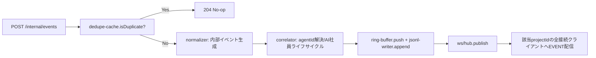

# 14. バックエンド設計

## 1. ディレクトリ構成(バックエンド部分)

```
apps/server/
├── src/
│   ├── index.ts                  # Fastify起動エントリ
│   ├── routes/
│   │   ├── internal-events.ts    # POST /internal/events
│   │   ├── projects.ts
│   │   ├── sessions.ts
│   │   ├── stats.ts
│   │   ├── settings.ts
│   │   └── connection.ts
│   ├── ws/
│   │   ├── hub.ts                # WebSocket Hub本体
│   │   └── protocol.ts           # HELLO/SNAPSHOT/EVENT等メッセージ型
│   ├── core/
│   │   ├── normalizer.ts         # 生Hookペイロード→内部イベント変換
│   │   ├── correlator.ts         # agent_id相関・AI社員ライフサイクル管理
│   │   ├── tool-classification.ts# toolName→state/areaマッピング(05章3節)
│   │   ├── message-templates.ts  # message生成テンプレート
│   │   └── dedupe-cache.ts       # clientEventId LRUキャッシュ
│   ├── persistence/
│   │   ├── ring-buffer.ts        # インメモリ直近イベント保持
│   │   └── jsonl-writer.ts       # ~/.agentia/logs/*.jsonl追記
│   └── config/
│       └── env.ts
└── package.json

packages/hook-forwarder/
├── bin.js                        # `agentia-hook` CLIエントリ(stdin読取→POST)
└── src/forward.ts
```

## 2. Ingest Server内部フロー



## 3. Correlatorの状態管理

```typescript
interface AgentRuntimeState {
  agentId: string;
  agentType: string;
  parentAgentId: string | null;
  lastEventAt: number;         // epoch ms、非アクティブ判定に使用
  recentToolNames: string[];   // 直近5件、動的役職再評価に使用(09章2.2節)
}

class SessionCorrelator {
  private agents = new Map<string, AgentRuntimeState>();
  resolve(hookPayload: RawHookPayload): { agentId: string; isNewAgent: boolean } { /* ... */ }
  sweepInactive(timeoutMs = 90_000): string[] { /* SubagentStop未受信でも90秒でagent_stop合成 */ }
}
```

- `sweepInactive`は各セッションにつき5秒周期のタイマーで実行し、非アクティブなAgentを検出して`agent_stop`イベントを合成・配信する。

## 4. WebSocket Hub設計

- プロジェクトID単位で`Map<projectId, Set<WebSocket>>`を保持。
- 各セッションのイベントにはセッション単位で単調増加する`seq`を`Map<sessionId, number>`カウンタで払い出す。
- 直近イベントは`ring-buffer.ts`が`sessionId`単位で最大2000件保持し、再接続時の`REPLAY`に使用(`06_REALTIME_COMMUNICATION.md`)。

## 5. マルチプロジェクト対応

- Ingest APIは`POST /internal/events`受信時、Hookペイロードの`cwd`からプロジェクトを解決する(`Project.rootPath`の前方一致で判定、登録が無ければ自動登録)。
- 複数のClaude Codeプロセスが異なるプロジェクトで同時に動いていても、`projectId`ごとに完全に独立したセッション・エージェント状態を管理する。

## 6. エラーハンドリング方針

| 層 | 方針 |
|---|---|
| Hook Forwarder | HTTP POST失敗時は最大2回リトライ(短いタイムアウト)、それでも失敗したらローカルにエラーログを残しClaude Code自体は継続させる(`async`優先、UI欠落よりもClaude Code動作優先) |
| Ingest API | 不正なペイロード(スキーマ不一致)は`400`を返しつつサーバー全体は継続動作。ログに警告を記録 |
| Correlator | 未知の`agentType`は`generic`にフォールバックし処理を止めない |
| WebSocket Hub | クライアント側の異常切断は例外を握りつぶし、Setから除去するのみ(他クライアントに影響させない) |
| 永続化層 | JSONL書き込み失敗(ディスク容量等)はリングバッファのみで継続し、警告をヘルスチェックAPIに反映 |

## 7. ロギング設計

- 構造化ログ(pino)を採用し、`level`, `eventType`, `sessionId`, `projectId`を必須フィールドとする。
- Ingest API自体の観測性(受信件数/秒、WebSocket接続数、リトライ回数)を`/api/connection/status`で確認できるようにする(内部メトリクス、Prometheus形式は将来検討)。

## 8. 環境変数管理

| 変数 | 用途 | 既定値 |
|---|---|---|
| `AGENTIA_SERVER_PORT` | Ingest/REST/WSサーバーのポート | `4317` |
| `AGENTIA_WEB_PORT` | Next.js開発サーバーのポート | `3000` |
| `AGENTIA_LOG_DIR` | JSONLログ出力先 | `~/.agentia/logs` |
| `AGENTIA_DATA_DIR` | 将来のSQLite/設定ファイル格納先 | `~/.agentia/data` |
| `AGENTIA_ALLOW_REMOTE` | trueで`0.0.0.0`バインド・トークン認証必須化 | `false` |
| `AGENTIA_ACCESS_TOKEN` | `AGENTIA_ALLOW_REMOTE=true`時の接続トークン | (未設定) |

`.env.example`をリポジトリに用意し、実値は`.env.local`(gitignore対象)で管理する。
