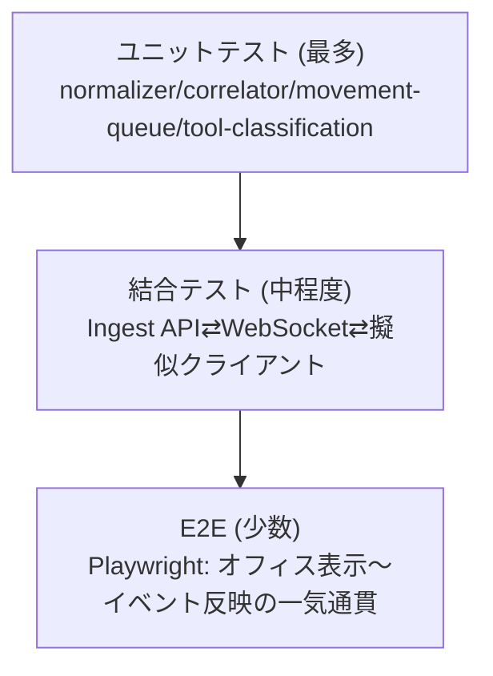

# 16. テスト方針

## 1. テストピラミッド

## 2. バックエンドテスト

| 対象 | 種別 | 内容 |
|---|---|---|
| `normalizer.ts` | ユニット | 各Hookイベントの生ペイロード例→内部イベントへの変換が仕様通りか(`04`/`05`章のフィールド対応表を網羅) |
| `correlator.ts` | ユニット | 未知agent_id出現→`agent_spawn`合成、90秒無応答→`agent_stop`合成、`agentType`動的再評価ロジック |
| `tool-classification.ts` | ユニット | toolName/コマンド文字列パターン→state/areaマッピングの網羅(境界値: 大文字小文字、複合コマンド`cmd1 && cmd2`等) |
| `dedupe-cache.ts` | ユニット | 同一`clientEventId`の二重POSTが1件として扱われるか |
| WebSocket Hub | 結合 | 複数クライアント接続時のブロードキャスト、`seq`払い出しの単調増加性、再接続時`REPLAY`の正確性 |
| REST API全般 | 結合 | Fastifyの`inject`機能を用いたスキーマ検証・エラーレスポンス形式の一貫性 |
| Hook Forwarder | ユニット | stdin JSON→HTTP POSTペイロードの整形、POST失敗時のリトライ・非ブロッキング動作(タイムアウト遵守) |

## 3. フロントエンドテスト

| 対象 | 種別 | 内容 |
|---|---|---|
| `applyEvent`(reducer相当) | ユニット | 各`eventType`受信時のEmployee状態遷移が`09_CHARACTER_SYSTEM.md`の状態遷移図と一致するか |
| 移動キュー(`movement-queue.ts`) | ユニット | 優先度による中断/キュー追加/間引きロジック(10章4.2節)の網羅的検証 |
| `useOfficeSocket` | 結合(モックWebSocketサーバー) | 再接続バックオフ、seqギャップ検知、RESYNC要求の発火条件 |
| 画面コンポーネント(Dashboard/History/Projects/Stats/Settings) | コンポーネントテスト(Testing Library) | 主要な表示項目のレンダリング、空状態・エラー状態の表示 |
| PixiJS描画層 | 手動+スモークテスト中心 | キャンバス描画はスナップショットテストの費用対効果が低いため、Playwrightでのビジュアル簡易確認に留める |

## 4. E2Eテスト(Playwright)

代表シナリオ:

1. Hooksからダミーイベント(Read→Edit→Bash→Test→Stop)を順次送出し、バーチャルオフィス上でキャラクターが対応エリアへ移動、最終的に休憩スペースへ戻ることを確認。
2. WebSocket切断→再接続をシミュレートし、イベント欠落なく状態が復元されることを確認。
3. 複数Sub Agent(3体)を同時発生させ、それぞれ独立したエリアで作業状態になることを確認。
4. プロジェクト切り替え操作で、表示されるAI社員・ログが正しく切り替わることを確認。

## 5. パフォーマンステスト

- 疑似的に高頻度イベント(100イベント/秒)をIngest APIへ送出し、WebSocket配信の遅延・取りこぼしが無いことを検証する負荷テストスクリプトを`packages/server/test/load/`に用意する。

## 6. CI方針

- PR毎に: Lint(ESLint) → 型チェック(`tsc --noEmit`) → ユニット/結合テスト(Vitest) → 主要E2Eシナリオ(Playwright、変更影響がある場合のみ)をGitHub Actionsで実行する。
- カバレッジ目標: `core/`(normalizer, correlator, tool-classification)は80%以上、フロントエンドの状態ロジック(`applyEvent`, `movement-queue`)も80%以上。描画レイヤーはカバレッジ目標対象外とする。

## 7. テスト可能性のための設計原則

- イベント処理・状態遷移ロジックは副作用(DOM描画、WebSocket送受信そのもの)から分離した純粋関数として実装する(`13`/`14`章の構成方針と一致)。
- 時刻依存のロジック(90秒非アクティブ判定等)は`Date.now`を直接呼ばずクロックインターフェースを注入し、テストで時間経過をシミュレートできるようにする。
