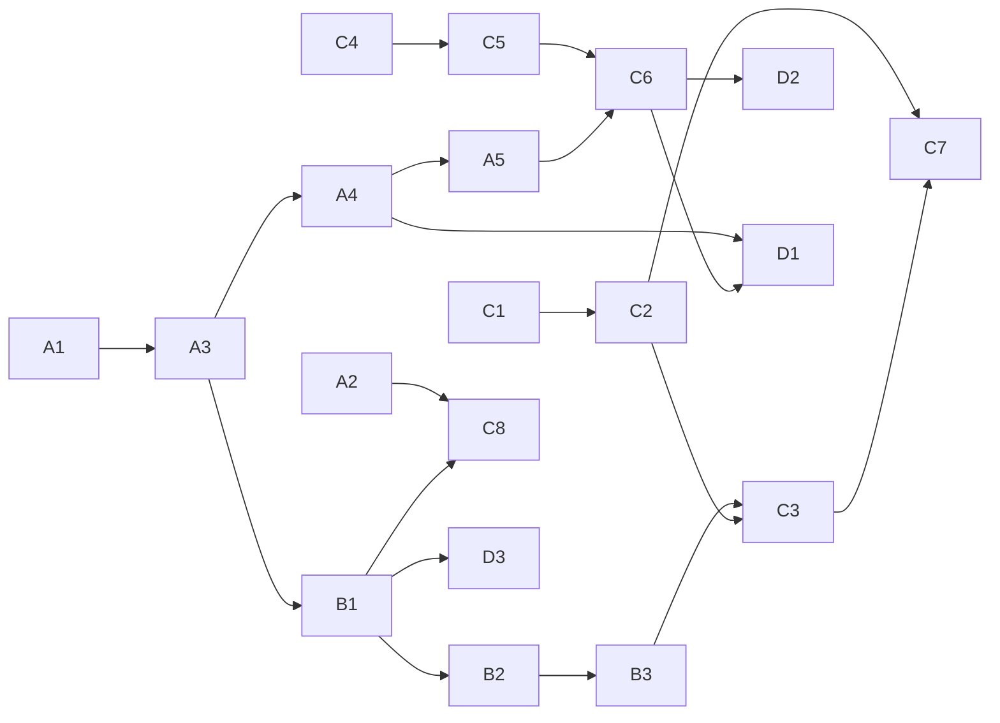

# 17. MVP計画

## 1. MVPスコープ

### 対応イベント
Read / Grep / Glob(reading)、Edit / Write(coding)、Bash(terminal、test系はtesting)、Stop(completed)、Notification(waiting)、エラー(error)。

### 対応AI社員
メインエージェント(Claude)1体のみ。Sub Agent可視化はPhase2。

### 対応オフィスエリア
開発デスク、調査スペース(本棚・資料エリアと調査・リサーチスペースは統合した「調査スペース」1エリアとしてMVPでは簡略化)、ターミナル、テストルーム、休憩スペース、の5エリア。会議室・デプロイ・サーバー・GitHub・PM・個人デスク分離等はPhase2以降。

### 対応画面
バーチャルオフィス画面、Claude Code接続設定画面のみ。ダッシュボード/履歴/プロジェクト/統計/設定はPhase2以降(MVPでは接続設定画面から直接オフィスへ遷移する導線のみ)。

### 非対応
DB永続化、複数プロジェクト切替、GitHub連携、ゲーム要素、Sub Agent表示。

## 2. MVP実装タスク分解

### Track A: Hook連携基盤
- A1. `packages/hook-forwarder`: stdin JSON受信→非同期HTTP POST CLIの実装
- A2. `.claude/settings.json`セットアップ用ドキュメント・サンプル作成
- A3. Ingest API(`POST /internal/events`)の実装(Fastify雛形含む)
- A4. `normalizer.ts`: MVP対象6イベントの内部フォーマット変換
- A5. `tool-classification.ts`: MVP対象ツールのstate/areaマッピング表実装

### Track B: リアルタイム配信基盤
- B1. WebSocket Hub実装(単一プロジェクト・単一セッション前提の簡易版)
- B2. `seq`払い出し・インメモリリングバッファ
- B3. `HELLO`/`SNAPSHOT`/`EVENT`/`HEARTBEAT`メッセージ実装
- B4. 再接続・バックオフ・リプレイのクライアント側実装

### Track C: フロントエンド基盤
- C1. Next.jsプロジェクト雛形、`AppShell`、ルーティング(`/office`, `/settings/connection`のみ)
- C2. Zustandストア(`OfficeStore`)実装
- C3. `useOfficeSocket`フック実装
- C4. PixiJSキャンバスセットアップ、5エリアのマップ描画(`map.json`)
- C5. キャラクタースプライト・状態別アニメーション(idle/moving/reading/coding/terminal/testing/waiting/error/completed)
- C6. 移動キュー・パスファインディング(5エリア間の簡易ウェイポイント)
- C7. サイドパネル(現在の作業カード、アクティビティログ)実装
- C8. Claude Code接続設定画面(ワンクリックセットアップ、接続テスト)

### Track D: 品質保証
- D1. `normalizer`/`tool-classification`/`applyEvent`/`movement-queue`のユニットテスト
- D2. E2Eシナリオ(Read→Edit→Bash→Test→Stop一気通貫)のPlaywrightテスト
- D3. 負荷テスト(擬似高頻度イベント送出)

## 3. 実装順序(推奨)

推奨着手順: **A1→A3→A4→A5(バックエンド最小疎通)** → **B1〜B3(配信経路)** → **C1〜C4(フロント基盤+マップ)** → **C5〜C6(キャラクター動作)** → **C7〜C8(情報表示・セットアップUI)** → **D1〜D3(品質保証)**。最初にバックエンド〜配信経路のみでダミーイベントが最小構成のフロントに届くことを確認してから、キャラクター表現に着手する。

## 4. MVP完了の定義 (Definition of Done)

- 実際にClaude Codeで`.claude/settings.json`を設定し、Read/Edit/Bash/Testを含む一連の操作を行った際、ブラウザ上でキャラクターが対応エリアへ移動し状態表示が変わることを目視確認できる。
- WebSocketを意図的に切断しても自動再接続し、イベントの欠落なく状態が復元される。
- ユニットテスト・E2Eテスト(2章D1・D2)がCIでグリーンである。
